# Chainlink Treasury Sentinel (DeFi POC) 🛡️

> A solvency-focused lending protocol meant to simulate internal treasury operations, built with **Foundry** and secured by **Chainlink Data Feeds**.


## 📖 Overview

This project is a Proof of Concept (POC) designed to demonstrate how **Chainlink's Digital Assets Treasury** can leverage DeFi primitives to manage liquidity and yield.

It implements an over-collateralized lending pool where users (or the Treasury) can deposit ETH as collateral to borrow stablecoins (USDC), mirroring the architecture of protocols like Aave or Compound, but with strict risk parameters suitable for institutional operations.

## 🏗️ Architecture

The system is composed of two main contracts:

1.  **`SimpleLending.sol`**: The core logic handler.
    * **Risk Engine:** Enforces a 50% Loan-to-Value (LTV) ratio.
    * **Oracle Integration:** Consumes the `ETH/USD` Chainlink Data Feed on Mainnet to calculate real-time collateral valuation.
    * **Solvency Checks:** Handles both borrowing limits and **solvency-aware withdrawals** (preventing users from withdrawing collateral if it exposes the protocol to bad debt).

2.  **`MockUSDC.sol`**: An ERC-20 token used to simulate stablecoin liquidity seeding during tests.

### Workflow Diagram

```mermaid
sequenceDiagram
    participant User as 👤 Treasury Manager
    participant Contract as 🏦 LendingPool
    participant Oracle as 🔮 Chainlink Feed
    participant Token as 💰 USDC Contract

    User->>Contract: 1. call borrowUsdc($1000)
    
    rect rgb(30, 30, 30)
        Note right of Contract: Risk Assessment Phase
        Contract->>Contract: Get User's ETH Balance
        Contract->>Oracle: 2. latestRoundData() (Get ETH Price)
        Oracle-->>Contract: Return Price ($2,500)
        Contract->>Contract: 3. Calculate Collateral Value ($2500 * ETH)
        Contract->>Contract: 4. Check LTV (Max Debt < 50%)
    end
    
    alt Health Factor OK
        Contract->>Contract: Update User Debt (+ $1000)
        Contract->>Token: 5. transfer($1000, to: User)
        Token-->>User: 6. Tokens Received
        Contract-->>User: Emit Borrow Event
    else Health Factor Low
        Contract-->>User: ❌ REVERT transaction
    end
```



## 🔐 Key Features (Why Chainlink?)

* **Trust-Minimized Valuation:** Instead of relying on centralized price sources, the protocol uses Chainlink's decentralized aggregator network to determine asset value, preventing flash-loan manipulation attacks.
* **Atomic Solvency Checks:** Every borrow action is atomically validated against the user's Health Factor. If the collateral value drops or debt increases beyond the LTV threshold, the transaction reverts instantly.
* **Mainnet Fork Testing:** The test suite utilizes Foundry's fork capabilities to interact with the **live Chainlink Aggregator** on Ethereum Mainnet, ensuring the code works with real-world data, not just mocks.

## 🛠️ Technical Deep Dive

### 1. The `borrowUsdc` Logic
This function follows a strict **Checks-Effects-Interactions** pattern to prevent reentrancy:
1.  **Valuation:** Fetches user's ETH balance * Chainlink Price.
2.  **Validation:** `require(CurrentDebt + NewBorrow <= MaxBorrow)`.
3.  **State Update:** Increases the user's debt balance in storage.
4.  **Transfer:** Sends the requested USDC amount to the user.

### 2. The `withdrawCollateral` Logic
Withdrawals are the most critical point for protocol solvency. We cannot simply return funds; we must ensure the user remains healthy *after* the funds leave.
1.  **Simulation:** Calculate `RemainingCollateral = CurrentCollateral - WithdrawAmount`.
2.  **Hypothetical Check:** If `RemainingCollateral` is insufficient to cover existing `Debt`, the transaction reverts (`"Health Factor would be too low"`).
3.  **Math Safety:** Uses `(Collateral * Price * LTV) / (1e8 * 100)` ordering to prevent precision loss.

## 📊 Scenario Analysis

**Assumptions:** ETH Price: $2,500 | User Collateral: 1 ETH | LTV: 50% (Max Borrow: $1,250).

#### 🟢 Happy Path (Solvent)
* **Action:** User borrows $1,000.
* **Check:** `$1,000 <= $1,250`? **YES**.
* **Result:** Transfer succeeds.

#### 🔴 Unhappy Path (Insolvent)
* **Action:** User borrows $1,300.
* **Check:** `$1,300 <= $1,250`? **NO**.
* **Result:** Transaction **REVERTS**. State remains unchanged.

## 🛡️ Security & Static Analysis (Slither)

This project uses **Slither** for static analysis to ensure code safety and gas optimization.

### Installation & Usage
```bash
# Install via pipx (Recommended for Mac/Linux)
pipx install slither-analyzer

# Run analysis
slither .
```

### 🔍 Audit Notes (False Positives & Design Choices)
If running Slither, you may notice specific warnings. Here is how we mitigate them:

1.  **Reentrancy (`borrowUsdc` / `withdrawCollateral`):**
    * *Warning:* Events are emitted after external calls.
    * *Defense:* The protocol strictly follows the **Checks-Effects-Interactions** pattern. Internal balances are updated *before* any external token transfer, rendering reentrancy attacks mathematically impossible.

2.  **Timestamp Dependence (`block.timestamp`):**
    * *Warning:* Dangerous usage of timestamp.
    * *Defense:* Used intentionally to validate Chainlink Oracle data freshness. We reject prices older than 1 hour to prevent Stale Price attacks.

3.  **Low-Level Calls:**
    * *Warning:* Use of `.call` for ETH transfers.
    * *Defense:* `.transfer` sends a fixed gas amount (2300), which breaks compatibility with smart contract wallets (like Gnosis Safe). We use `.call` with a success check, which is the modern Solidity standard.

4.  **Naming Conventions (Foundry vs Slither):**
    * *Conflict:* Slither suggests `mixedCase` for immutables.
    * *Decision:* We adhere to the **Foundry Style Guide**, which enforces `SCREAMING_SNAKE_CASE` for `immutable` variables (`USDC_TOKEN`, `PRICE_FEED`).

## 🚀 Getting Started

### Prerequisites
* [Foundry](https://book.getfoundry.sh/getting-started/installation) (Forge, Cast, Anvil)

### Installation

```bash
# Clone the repo
git clone https://github.com/YOUR_USERNAME/chainlink-treasury.git
cd chainlink-treasury

# Install dependencies (OpenZeppelin & Chainlink)
forge install
```

### Running Tests (Mainnet Fork)

To test the integration with the real Chainlink Oracle, we fork the Ethereum Mainnet.

```bash
# Replace with your Alchemy/Infura RPC URL
forge test --fork-url https://eth-mainnet.g.alchemy.com/v2/YOUR_API_KEY -vv
```

## 📜 License
MIT