# Chainlink Treasury Sentinel (DeFi POC) 🛡️

> A solvency-focused lending protocol meant to simulate internal treasury operations, built with **Foundry** and secured by **Chainlink Data Feeds**.


## 📖 Overview

This project is a Proof of Concept (POC) designed to demonstrate how **Chainlink's Digital Assets Treasury** can leverage DeFi primitives to manage liquidity and yield.

It implements an over-collateralized lending pool where users (or the Treasury) can deposit ETH as collateral to borrow stablecoins (USDC), mirroring the architecture of protocols like Aave or Compound, but with strict risk parameters suitable for institutional operations.

## 🏗️ Architecture

The system is composed of two main contracts:

1.  **`SimpleLending.sol`**: The core logic handler.
    * **Risk Engine:** Enforces a 50% Loan-to-Value (LTV) ratio.
    * **Oracle Integration:** Consumes the `ETH/USD` Chainlink Data Feed on Mainnet to calculate real-time collateral valuation.
    * **Asset Management:** Handles custody of ETH collateral and issuance of USDC debt.

2.  **`MockUSDC.sol`**: An ERC-20 token used to simulate stablecoin liquidity seeding during tests.

### Workflow Diagram

```mermaid
sequenceDiagram
    participant User as 👤 Treasury Manager
    participant Contract as 🏦 LendingPool
    participant Oracle as 🔮 Chainlink Feed
    participant Token as 💰 USDC Contract

    User->>Contract: 1. call borrowUsdc($1000)
    
    rect rgb(30, 30, 30)
        Note right of Contract: Risk Assessment Phase
        Contract->>Contract: Get User's ETH Balance
        Contract->>Oracle: 2. latestRoundData() (Get ETH Price)
        Oracle-->>Contract: Return Price ($2,500)
        Contract->>Contract: 3. Calculate Collateral Value ($2500 * ETH)
        Contract->>Contract: 4. Check LTV (Max Debt < 50%)
    end
    
    alt Health Factor OK
        Contract->>Contract: Update User Debt (+ $1000)
        Contract->>Token: 5. transfer($1000, to: User)
        Token-->>User: 6. Tokens Received
        Contract-->>User: Emit Borrow Event
    else Health Factor Low
        Contract-->>User: ❌ REVERT transaction
    end
```



## 🔐 Key Features (Why Chainlink?)

* **Trust-Minimized Valuation:** Instead of relying on centralized price sources, the protocol uses Chainlink's decentralized aggregator network to determine asset value, preventing flash-loan manipulation attacks.
* **Atomic Solvency Checks:** Every borrow action is atomically validated against the user's Health Factor. If the collateral value drops or debt increases beyond the LTV threshold, the transaction reverts instantly.
* **Mainnet Fork Testing:** The test suite utilizes Foundry's fork capabilities to interact with the **live Chainlink Aggregator** on Ethereum Mainnet, ensuring the code works with real-world data, not just mocks.

## 🛠️ Technical Deep Dive: The `borrowUsdc` Logic

The critical function for treasury safety is `borrowUsdc`. It follows a strict **Checks-Effects-Interactions** pattern:

1.  **Valuation:** Fetches the user's ETH balance and multiplies it by the latest Chainlink price.
    * *Math:* Normalized to 18 decimals to match solidity standards.
2.  **Risk Calculation:** `MaxBorrow = (CollateralValue * LTV) / 100`.
3.  **Validation:** `require(CurrentDebt + NewBorrow <= MaxBorrow)`.
4.  **State Update:** Increases the user's debt balance in storage.
5.  **Transfer:** Sends the requested USDC amount to the user.

### 📊 Scenario Analysis: The Borrowing Logic

Let's simulate a real-world scenario to understand the solvency checks.

**Assumptions:**
* **ETH Price (Chainlink Feed):** $2,500 (`2500 * 10^8`)
* **User Collateral:** 1 ETH (`1 * 10^18`)
* **LTV (Risk Param):** 50%

#### Step-by-Step Calculation
1.  **Valuation:** The contract calculates the USD value of the collateral.
    * Math: `(1 ETH * $2,500) = $2,500`
2.  **Borrow Capacity:** It applies the LTV.
    * Math: `$2,500 * 50% = $1,250`
    * *Result:* The user can borrow **up to 1,250 USDC**.

#### 🟢 Happy Path (Solvent)
* **User Action:** Calls `borrowUsdc(1000 * 10^18)` (Borrowing $1,000).
* **Check:** Is `$1,000 <= $1,250`? **YES**.
* **Result:**
    1.  User receives 1,000 USDC.
    2.  User's internal debt becomes $1,000.
    3.  Transaction succeeds.

#### 🔴 Unhappy Path (Insolvent / Revert)
* **User Action:** Calls `borrowUsdc(1,300 * 10^18)` (Borrowing $1,300).
* **Check:** Is `$1,300 <= $1,250`? **NO**.
* **Result:**
    * The transaction **REVERTS** immediately.
    * Error Message: `"Health Factor too low! Add more collateral."`
    * No gas is wasted on token transfers; the state remains unchanged.
    
## 🚀 Getting Started

### Prerequisites
* [Foundry](https://book.getfoundry.sh/getting-started/installation) (Forge, Cast, Anvil)

### Installation

```bash
# Clone the repo
git clone [https://github.com/YOUR_USERNAME/chainlink-treasury.git](https://github.com/YOUR_USERNAME/chainlink-treasury.git)
cd chainlink-treasury

# Install dependencies (OpenZeppelin & Chainlink)
forge install
```

### Running Tests (Mainnet Fork)

To test the integration with the real Chainlink Oracle, we fork the Ethereum Mainnet.

```bash
# Replace with your Alchemy/Infura RPC URL
forge test --fork-url [https://eth-mainnet.g.alchemy.com/v2/YOUR_API_KEY](https://eth-mainnet.g.alchemy.com/v2/YOUR_API_KEY) -vv
```

### Output Example
```text
[PASS] testBorrowWithCollateral() (gas: 145023)
Logs:
  Current ETH Price from Chainlink: 250000000000
```

## 📜 License
MIT